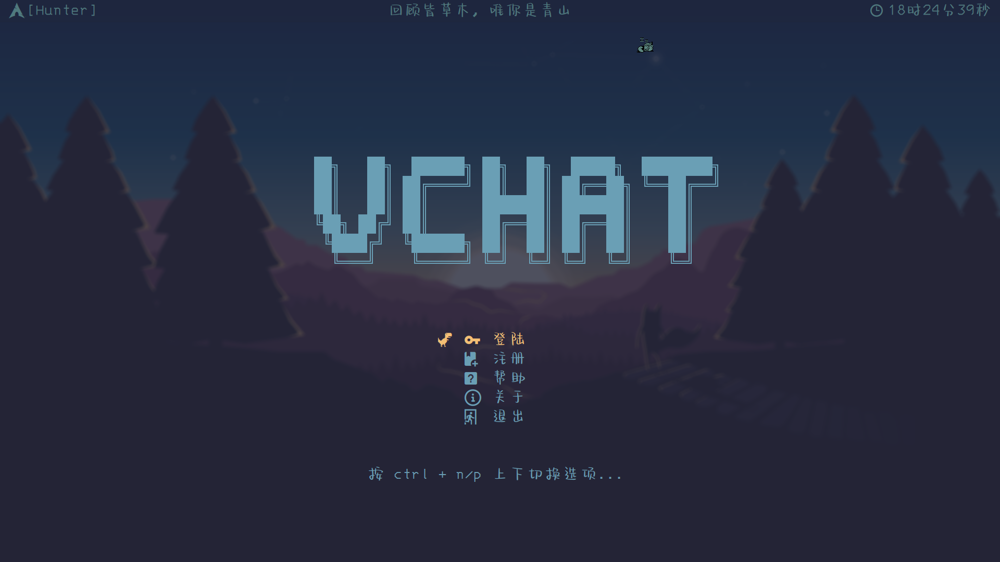
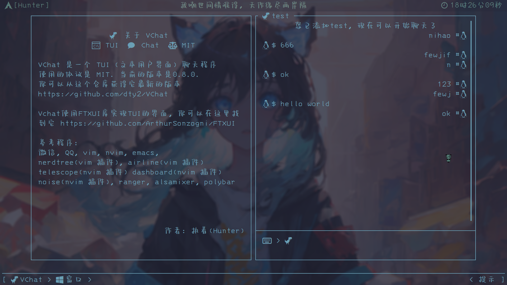

## VChat
VChat is a TUI Chat Program, which supports communication under the terminal.

More VChat pictures are in ./resource/example...
## Start
* Step One, you just need a Linux os with terminal simulator or only a tty!
* Step Two, clone this repository.
  - `git clone git@github.com:dty2/vchat.git`
  - or `git clone https://github.com/dty2/vchat.git`(if you don't have ssh)
* Step Three, install all third-party.
  - `cd [your vchat repository directory]`
  - `./install_lib.sh`. It will install all third-party library which is needed.
* Step Four, build vchat.
  - `mkdir build && cd build`
  - `cmake .. && make`
* Step Five, run vchat server and client.
  - `cd server && ./server`
  - `cd client && ./client`
## About
Latest version is 0.8
You can find all old version source codes in history directory.
### Feature
* Full keyboard operation, no mouse needed
* No graphics, can even run at tty
* Many kinds of errors
### Function
* Sign in/out
* Log in/out
* Add/delete friend
* Find someone
* Send message to friends
## Resource
### Library
* [FTXUI](https://github.com/ArthurSonzogni/FTXUI)
* [boost](https://www.boost.org/users/download/)
* [sqlitecpp](https://github.com/SRombauts/SQLiteCpp)
* [json](https://github.com/nlohmann/json)
* [glog](https://github.com/google/glog)
### Tools
* [find icon font](https://www.nerdfonts.com/cheat-sheet)
* downlaod cowsay by `sudo pacman -S cowsay`
* [asciinema](https://docs.asciinema.org/)
## FAQ
* Contribute
This prorgram is developed by myself(a cpp beginner). And it is so terrible that I think nobody will contribute it...
* VChat not work
You can write a issue, I will answer you in two days.
* "install_lib.sh" is not work
You can install all library by your self. Or you can modify it, I think the most problem is url error.
